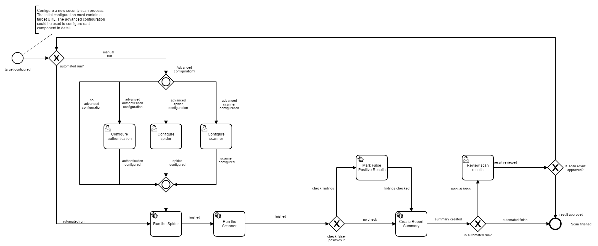
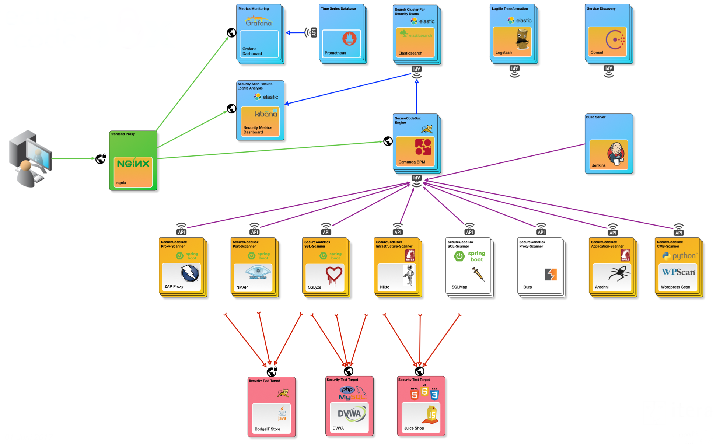

# Continuous Secure Delivery - Out of the Box


> _secureCodeBox_ is a docker based, modularized toolchain for continuous security scans of your software project.

## Overview

<!-- toc -->
- [Purpose of this Project](#purpose-of-this-project)
- [Quickstart](#quickstart)
- [How Does it Work?](#how-does-it-work)
- [Architecture](#architecture)
- [Roadmap](#roadmap)

For additional documentation aspects please have a look at our:
- [Developer Guide](docs/developer-guide/README.md)
- [User Guide](docs/developer-guide/README.md)

<!-- tocstop -->

## Purpose of this Project

The typical way to ensure application security is to hire a security specialist (aka penetration tester) at some point in your project to check the application for security bugs and vulnerabilities. Usually, this happens very late in the project and has various drawbacks:

1. Nowadays, a lot of projects do continuous delivery, which means the developers deploy new versions multiple times each day. The penetration tester is only able to check a single snapshot, but some further commits could introduce new security issues. To ensure ongoing application security, the penetration tester should also repeatedly test the application. Unfortunately, such approach is rarely financially feasible.
2. In the typically time boxed analysis, the penetration tester may be engaged in finding trivial security issues (low-hanging fruits) and therefore will never reach the serious, non-obvious ones.

With the _secureCodeBox_ we provide a toolchain for continuous scanning of applications to find the low-hanging fruit issues early in the development process and free the resources of the penetration tester to concentrate on the major security issues.

The purpose of *secureCodeBox* **is not** to replace the penetration testers or make them obsolete. We strongly recommend to run extensive tests by experienced penetration testers on all your applications.

**Important note**: The _secureCodeBox_ is no simple one-button-click-solution! You must have a deep understanding of security and how to configure the scanners. Furthermore, an understanding of the scan results and how to interpret them is also necessary.

There is a german article about [Security DevOps – Angreifern (immer) einen Schritt voraus][secdevops-objspec] in the software engineering journal [OBJEKTSpektrum][objspec].

## Quickstart

### Prerequisites
 * Minimal Docker version 18.03.0 is required
 * Docker-Compose is required.

For a quick start checkout this repository and start the complete secureCodeBox stack with docker-compse:

```bash
git clone https://github.com/secureCodeBox/secureCodeBox
cd secureCodeBox
```

### Start with Docker-Compose
The docker-compose.yml file can be used to launch a secureCodeBox instance.
```bash
docker-compose up
```
Running `docker-compose up` uses the default credentials specified in the [`.env`](https://github.com/secureCodeBox/starter/blob/master/.env) file. You can override these by changing the file or setting the environment variables on your system. Before running the SecureCodeBox in a more serious environment you should at least change the following variables:
 * `CAMUNDADB_ROOT_PW` MySQL root password
 * `CAMUNDADB_USER` MySQL username used by the Camunda Engine
 * `CAMUNDADB_PW` MySQL password also used by the Camunda Engine

### Run your first security scan
There are several ways to start a security scan with the secureCodeBox. As a first shot try the WebUI of the engine and start one manually.

[http://your-docker-host:8080/](http://localhost:8080)

1. Create a local user account
2. Open the "Tasklist"
3. Click on "start security scan" in the menu
4. Select one of the implemented scan process (e.g. NMAP)
5. Configure the Scanner and hit "complete"
6. Wait for the result and have fun

## How Does it Work?

The core of the _secureCodeBox_ is a process engine (based on the camunda platform), which allows the user to define the whole scan process. The following image shows an example of a scan process:



The scan itself may be triggered via the WebUI, an REST-API call or via webhooks. The system allows continous integration software such as Jenkins, Travis CI, Bamboo etc. to trigger a scan automatically. The scan itself will be handed over to the scanners and the results will be aggregated for review in the control center or the CI environment. For a detailed description of the components and how they work together see the [architecture](#architecture) section.

## Architecture

The base architecture is a [Docker][docker] based [Microservices Architecture][microservices] as shown in the picture below.



### Design Goal

The most important goal of the architecture is to build the whole toolchain highly modularized, extensible, and scalable. Therefore, we decided to provision the various parts in a microservice architecture style combined with [Docker][docker] as infrastructure. This design gives us the possibility to add new components very easily by adding a new container as independent microservice and integrating it with the core engine via a well defined REST interface.

### Components

#### Process Engine – the Core

The main component of the _secureCodeBox_ is the [Camunda][camunda] [BPMN][bpmn] engine, which allows the engineer to build the whole scan process as a [BPMN][bpmn] model. This component also provides the main web UI: The _secureCodeBox_ control center. In this UI you can see the available scan process definitions as [BPMN][bpmn] diagrams, start them (Tasklist), and manually review the results. Furthermore, the core provides a possibility to listen on webhooks and integrate the exposed process API, allowing us to trigger the scan processes by a continuous integration component, such as [Jenkins][jenkins], in our example, or any other which can deal with webhooks.

#### Scanners

The scanners are individual tools such as [nmap][nmap], [Nikto][nikto], [Arcachni][arcachni] and such. Every scanner tool runs in its own [Docker][docker] container. This has two main reasons:

1. You can easily add and integrate a new tool as a scanner, based on a language or technology of your choice, given that it can run inside [Docker][docker].
1. You can scale up the numbers of running scanners for massive parallel scanning

Each scanner needs a small adapter, usually written in Java, Ruby, Python, or JavaScript. The goal of the adapter is twofold. Firstly, it needs to translate the configuration data, defining what to do, from the engine format into a format usable by the particular scanning tool. Secondly, it will transform the results of the scan into a format usable by the data collection component.

Also the scanners are responsible for polling the engine to check wether something needs to be done by using the [external service task pattern][exteralServiceTask]. The reason for polling instead of pushing the scan orders from the engine to the scanners is an easier and more fail tolerant implementation, otherwise the engine has to determine wether each scanner instance is still running. Also, it must recognize if a scanner dies. Thanks to the current polling implementation a scanner might die and just start polling for work after a restart.

Currently, we have severals scanners available out of the box:

- [Nmap][nmap] for IP and port scans
- [Nikto][nikto] for web server scans
- [SSLyze][sslyze] for SSL/TLS scans
- [SQLMap][sqlmap] for SQL injection scans
- [Arachni][arachni] web vulnerability scans
- [WPScan][wpscan] black box [WordPress][wordpress] vulnerability scans

But our architecture lets you also add your own non-free or commercial tools, like
- [Burp Suite][burp] web vulnerability scanner.

#### Data Collection

The collection of the scanner results is done by an ELK stack ([Elasticsearch][elasticsearch], [Kibana][kibana], and [Logstash][logstash]).

#### Example Targets

For demonstration purposes, we added some example targets to scan:

- [Damn Vulnerable Web Application][dvwa]
- [BodgeIT Store][bodgeit]
- [Juice Shop][juiceshop]

[nginx]:                https://nginx.org/en/
[camunda]:              https://camunda.com/de/
[exteralServiceTask]:   https://docs.camunda.org/manual/latest/user-guide/process-engine/external-tasks/
[bpmn]:                 https://en.wikipedia.org/wiki/Business_Process_Model_and_Notation
[docker]:               https://www.docker.com/
[consul]:               https://www.consul.io/
[microservices]:        https://martinfowler.com/articles/microservices.html
[beta-testers]:         https://www.securecodebox.io/
[owasp]:                https://www.owasp.org/index.php/Main_Page
[objspec]:              https://www.sigs-datacom.de/fachzeitschriften/objektspektrum.html
[secdevops-objspec]:    http://www.sigs.de/public/ots/2017/OTS_DevOps_2017/Seedorff_Pfaender_OTS_%20DevOps_2017.pdf
[jenkins]:              https://jenkins.io/
[nmap]:                 https://nmap.org/
[nikto]:                https://cirt.net/Nikto2
[arcachni]:             http://www.arachni-scanner.com/
[sslyze]:               https://github.com/nabla-c0d3/sslyze
[sqlmap]:               http://sqlmap.org/
[burp]:                 https://portswigger.net/burp
[arachni]:              http://www.arachni-scanner.com/
[wpscan]:               https://wpscan.org/
[wordpress]:            https://wordpress.com/
[consul]:               https://www.consul.io/
[resty]:                https://openresty.org/en/
[keycloak]:             http://www.keycloak.org/
[openid]:               https://de.wikipedia.org/wiki/OpenID
[elasticsearch]:        https://www.elastic.co/products/elasticsearch
[kibana]:               https://www.elastic.co/de/products/kibana
[logstash]:             https://www.elastic.co/products/logstash
[dvwa]:                 http://www.dvwa.co.uk/
[bodgeit]:              https://github.com/psiinon/bodgeit
[juiceshop]:            https://www.owasp.org/index.php/OWASP_Juice_Shop_Project

## Roadmap

At the moment, the _secureCodeBox_ is in a stable *beta state*. We are working hard on polishing and documenting and integrating new security scanner. Also we wish to become an official [OWASP][owasp] project.

## License
Code of secureCodeBox is licensed under Apache License 2.0.

## Community
You are welcome, please join us on... 👋
- GitHub
- Slack
- Twitter

## Contributing
Contributions are welcome and extremely helpful 🙌
