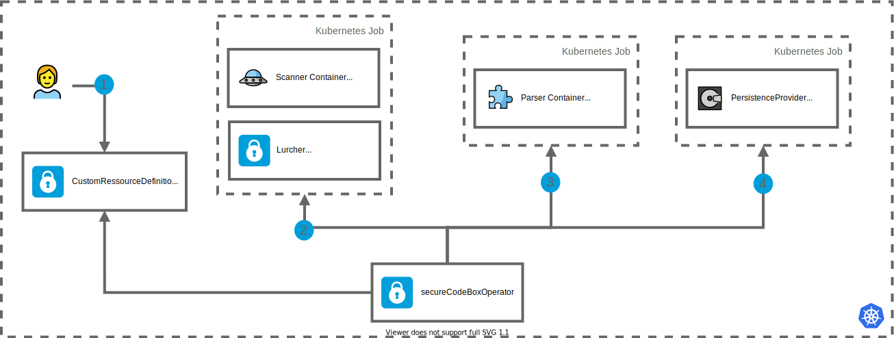

[](https://opensource.org/licenses/Apache-2.0)
[](https://github.com/secureCodeBox/secureCodeBox/releases/latest)

# Continuous Secure Delivery - Out of the Box


> _secureCodeBox_ is a docker based, modularized toolchain for continuous security scans of your software project. Its goal is to orchestrate and easily automate a bunch of security-testing tools out of the box.

## Overview

<!-- toc -->

- [Purpose of this Project](#purpose-of-this-project)
- [Quickstart](#quickstart)
- [How Does it Work?](#how-does-it-work)
- [Architecture](#architecture)
- [Roadmap](#roadmap)

For additional documentation aspects please have a look at our:

- [User Guide](docs/user-guide/README.md)
- [Developer Guide](docs/developer-guide/README.md)

<!-- tocstop -->

## Purpose of this Project

The typical way to ensure application security is to hire a security specialist (aka penetration tester) at some point in your project to check the application for security bugs and vulnerabilities. Usually, this check is done at a later stage of the project and has two major drawbacks:

1. Nowadays, a lot of projects do continuous delivery, which means the developers deploy new versions multiple times each day. The penetration tester is only able to check a single snapshot, but some further commits could introduce new security issues. To ensure ongoing application security, the penetration tester should also continuously test the application. Unfortunately, such an approach is rarely financially feasible.
2. Due to a typically time boxed analysis, the penetration tester has to focus on trivial security issues (low-hangig fruits) and therefore will not address the serious, non-obvious ones.

With the _secureCodeBox_ we provide a toolchain for continuous scanning of applications to find the low-hanging fruit issues early in the development process and free the resources of the penetration tester to concentrate on the major security issues.

The purpose of _secureCodeBox_ **is not** to replace the penetration testers or make them obsolete. We strongly recommend to run extensive tests by experienced penetration testers on all your applications.

**Important note**: The _secureCodeBox_ is no simple one-button-click-solution! You must have a deep understanding of security and how to configure the scanners. Furthermore, an understanding of the scan results and how to interpret them is also necessary.

There is a german article about [Security DevOps – Angreifern (immer) einen Schritt voraus][secdevops-objspec] in the software engineering journal [OBJEKTSpektrum][objspec].

## Quickstart

### Prerequisites

- kubernetes

### Deployment

```bash
# Will deploy a redis cluster and a minio deployment.
# You can disable the creation to use services like a hosted Redis solution or AWS S3, DigitalOcean Spaces or another compatible Solution.
helm install engine ./engine

# Deploy the dispatcher
helm install dispatcher ./dispatcher --set "dispatcherEnvironmentName=$(kubectl config current-context)"

# Deploy nmap, amass and ssh_scan ScanJob and ParseJob Definition
kubectl apply -f integrations/nmap/nmap-scanjob-definition.yaml -f integrations/nmap/nmap-parsejob-definition.yaml
kubectl apply -f integrations/amass/amass-scanjob-definition.yaml -f integrations/amass/amass-parsejob-definition.yaml
kubectl apply -f integrations/ssh_scan/ssh-scan-scanjob-definition.yaml -f integrations/ssh_scan/ssh-scan-parsejob-definition.yaml

# Elasticsearch Persistence Provider Deployment
helm install elasticsearch elastic/elasticsearch --version 7.4.0 --set replicas=1 --set minimumMasterNodes=1 --set image=docker.elastic.co/elasticsearch/elasticsearch-oss
helm install kibana elastic/kibana --version 7.4.0 --set image=docker.elastic.co/kibana/kibana-oss

kubectl apply -f persistence/elasticsearch/persistence-elk-deployment.yaml
```

## How does it work?

## Architecture



## License

Code of secureCodeBox is licensed under the [Apache License 2.0][scb-license].

## Community

You are welcome, please join us on... 👋

- [GitHub][scb-github]
- [Slack][scb-slack]
- [Twitter][scb-twitter]

secureCodeBox is an official [OWASP][owasp] project.

## Contributing

Contributions are welcome and extremely helpful 🙌

## Author Information

Sponsored by [iteratec GmbH](https://www.iteratec.de/) -
[secureCodeBox.io](https://www.securecodebox.io/)

[nginx]: https://nginx.org/en/
[camunda]: https://camunda.com/de/
[exteralservicetask]: https://docs.camunda.org/manual/latest/user-guide/process-engine/external-tasks/
[bpmn]: https://en.wikipedia.org/wiki/Business_Process_Model_and_Notation
[docker]: https://www.docker.com/
[consul]: https://www.consul.io/
[microservices]: https://martinfowler.com/articles/microservices.html
[beta-testers]: https://www.securecodebox.io/
[owasp]: https://www.owasp.org/index.php/OWASP_secureCodeBox
[objspec]: https://www.sigs-datacom.de/fachzeitschriften/objektspektrum.html
[secdevops-objspec]: http://www.sigs.de/public/ots/2017/OTS_DevOps_2017/Seedorff_Pfaender_OTS_%20DevOps_2017.pdf
[jenkins]: https://jenkins.io/
[nmap]: https://nmap.org/
[nikto]: https://cirt.net/Nikto2
[arcachni]: http://www.arachni-scanner.com/
[sslyze]: https://github.com/nabla-c0d3/sslyze
[sqlmap]: http://sqlmap.org/
[sshscan]: https://github.com/mozilla/ssh_scan_api
[burp]: https://portswigger.net/burp
[arachni]: http://www.arachni-scanner.com/
[wpscan]: https://wpscan.org/
[amass]: https://github.com/owasp/amass
[wordpress]: https://wordpress.com/
[consul]: https://www.consul.io/
[resty]: https://openresty.org/en/
[keycloak]: http://www.keycloak.org/
[openid]: https://de.wikipedia.org/wiki/OpenID
[elasticsearch]: https://www.elastic.co/products/elasticsearch
[kibana]: https://www.elastic.co/de/products/kibana
[logstash]: https://www.elastic.co/products/logstash
[dvwa]: http://www.dvwa.co.uk/
[bodgeit]: https://github.com/psiinon/bodgeit
[juiceshop]: https://www.owasp.org/index.php/OWASP_Juice_Shop_Project
[scb-github]: https://github.com/secureCodeBox/
[scb-engine]: https://github.com/secureCodeBox/engine
[scb-twitter]: https://twitter.com/secureCodeBox
[scb-slack]: https://join.slack.com/t/securecodebox/shared_invite/enQtNDU3MTUyOTM0NTMwLTJiNzg3MmU2ZDY2NDFiMGI0Y2FkM2I5Mzc2ZmEzYTcyN2FlN2Y2NDFiZDE5NjAxMjg1M2IxNDViNzE3OTIxMGU
[scb-license]: https://github.com/secureCodeBox/secureCodeBox/blob/master/LICENSE
