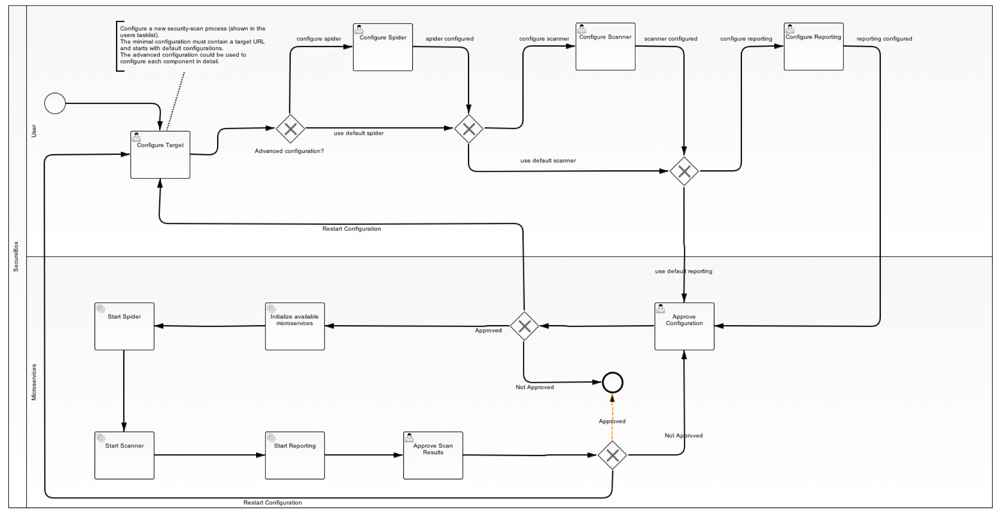

# secureCodeBox – Continuous Secure Delivery Out of the Box

> _secureCodeBox_ is a docker based, modularized toolchain for continuous security scans of your software project.

## Table of contents

<!-- toc -->
- [Purpose of this Project](#purpose-of-this-project)
- [How does it Works](#how-does-it-works)
- [Roadmap](#roadmap)
- [Architecture](#architecture)
<!-- tocstop -->

## Purpose of this Project

The typical way to ensure application security is to hire a security specialist (aka. penetration tester) at some point in your project to check the application for security bugs and vulnerabilities. Usually this happens very late in the project and has various drawbacks:

1. Nowadays a lot of projects do continuous delivery, which means multiple deployments a day. The penetration tester can only check a single snapshot of these deployments. But some commits later there may be new security issues introduced. So in consequence a penetration tester should also continuously check the application. But this is not affordable.
2. In the typically time boxed analysis, the penetration tester may be engaged in finding trivial security issues (low hanging fruits) and thus will not even reach the serious, non obvious ones.

With the _secureCodeBox_ we provide a toolchain to/for continuously scan/ning applications to find the low-hanging fruit issues in the development process. So that a penetration tester can concentrate on the major security issues.

It **is not** the purpose of *secureCodeBox* to make penetration testers obsolete. We strongly recommend letting your application be check by one!

## How does it Works

The core of the _secureCodeBox_ is the control center (a web UI). With this the whole scan process is defined. An example process is shown in the image below.

The scan itself may be triggered via the control center or via web hooks. The web hooks gives the possibility for a scan to be triggered by a CI such as Jenkins, Travis CI, Bamboo or such. The scan itself will be handed over to the scanners and the results will be aggregated for review in the control center or the CI environment. For a detailed description of the components and how they work together see the [architecture](#architecture) section.

**Important note**: The _secureCodeBox_ is no simple one button click solution! You must have a deep understanding of security and how to configure the scanners. Also it is necessary that you understand the results of of the scans and how to interpret them.

## Roadmap

At the moment the _secureCodeBox_ is in a stable beta state. You can register as a beta tester [here][beta-testers]. We are hard working on polishing and  documenting so that we can push all sources here on GitHub until the end of 2017. Also we want to become an official [OWASP][owasp] project.

## Architecture

The base architecture is a [Docker][docker] based [Microservices architecture][microservices].

TODO

[camunda]:          https://camunda.com/de/
[bpmn]:             https://en.wikipedia.org/wiki/Business_Process_Model_and_Notation
[docker]:           https://www.docker.com/
[microservices]:    https://martinfowler.com/articles/microservices.html
[beta-testers]:     https://www.securecodebox.io/
[owasp]:            https://www.owasp.org/index.php/Main_Page
