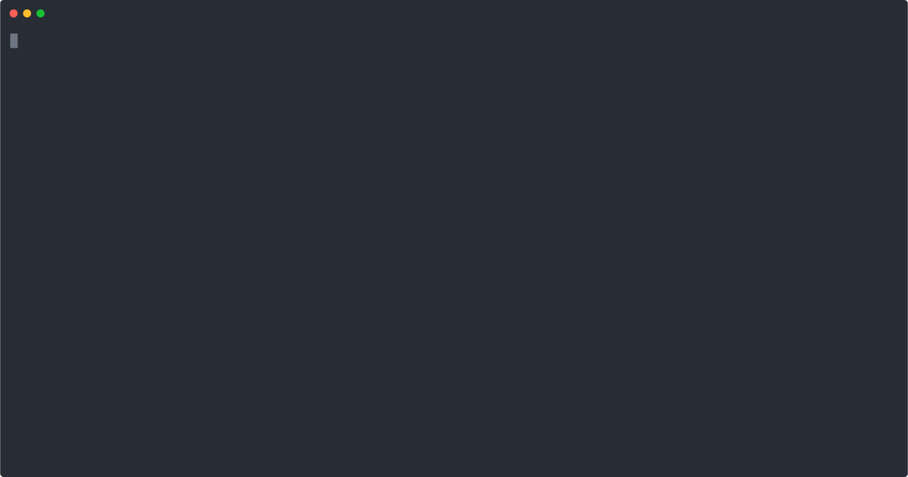

The secureCodeBox _AutoDiscovery_ is running on kubernetes (K8S) and is an optional component of the complete secureCodeBox stack.
The Kubernetes AutoDiscovery needs to be deployed along side the secureCodeBox Operator. It monitors security relevant resources inside a K8S environment and automatically create scans to continuously monitor security aspects of the resources.

<!-- end -->

The AutoDiscovery controller will automatically detect these new resources (services and containers) and start secureCodeBox _scans_ for them:

1. A ZAP Baseline Scan to detect basic web vulnerabilities in the service. (Using OWASP ZAP)
2. An image scan scanning for vulnerable libraries in the docker / container image of the deployment. (Using trivy)
3. (WIP) A TLS Scan against the certificate of the ingress for the host. (Using SSLyze)

The AutoDiscovery automatically tracks the lifecycle of the kubernetes resources and will automatically start new scans for new application versions.

<!--
SPDX-FileCopyrightText: the secureCodeBox authors

SPDX-License-Identifier: Apache-2.0
-->
<!--
.: IMPORTANT! :.
--------------------------
This file is generated automatically with `helm-docs` based on the following template files:
- ./.helm-docs/templates.gotmpl (general template data for all charts)
- ./chart-folder/.helm-docs.gotmpl (chart specific template data)

Please be aware of that and apply your changes only within those template files instead of this file.
Otherwise your changes will be reverted/overwritten automatically due to the build process `./.github/workflows/helm-docs.yaml`
--------------------------
-->

<p align="center">
  <a href="https://opensource.org/licenses/Apache-2.0"></a>
  <a href="https://github.com/secureCodeBox/secureCodeBox/releases/latest"></a>
  <a href="https://owasp.org/www-project-securecodebox/"></a>
  <a href="https://artifacthub.io/packages/search?repo=securecodebox"></a>
  <a href="https://github.com/secureCodeBox/secureCodeBox/"></a>
  <a href="https://twitter.com/securecodebox"></a>
</p>

## Example

<p align="center">
  
</p>

This example deploys [JuiceShop](https://owasp.org/www-project-juice-shop/) to a new Kubernetes Namespace.
(You can find the kubernetes manifests for the deployment [here](./demo/juice-shop.yaml))

The AutoDiscovery will automatically pick up this new deployment and then starts a OWASP ZAP Scan against it.
The scan created uses our `zap-advanced` ScanType by default, this can be changed with the `config.serviceAutoDiscovery.scanConfig.scanType` config on the autoDiscovery helm release.

When the ContainerAutoDiscovery is enabled, the AutoDiscovery can also create a trivy scan for each unique container image (having multiple pods with the same container will only create one scan). The scan type can be defined with `config.containerAutoDiscovery.scanConfig.scanType`.

## Deployment
The auto-discovery-kubernetes chart can be deployed via helm:

```bash
# Install HelmChart (use -n to configure another namespace)
helm upgrade --install auto-discovery-kubernetes secureCodeBox/auto-discovery-kubernetes
```

## Requirements

Kubernetes: `>=v1.11.0-0`

### In / Excluding Resources from the AutoDiscovery

The AutoDiscovery allows different modes to determine if a resource is supposed to be scanned.
These modes allow you to gradually roll out the AutoDiscovery in a cluster.
This allows to roll it out in cluster without a "big bang" where the AutoDiscovery starts a scan for every app in the cluster which would likely exhaust the clusters compute resources.

The three different modes are:

1. `enabled-per-namespace` (default): [See section](#enabled-per-namespace-mode-default)
2. `enabled-per-resource`: [See section](#enabled-per-resource-mode)
3. `all`: [See section](#all-mode)

#### Enabled per Namespace Mode (default)

Enable this by setting `config.resourceInclusion.mode=enable-per-namespace`.

This mode will start scans for resources in namespaces with the annotation `auto-discovery.securecodebox.io/enabled=true`.

```bash
# enable AutoDiscovery in namespace "juice-shop"
kubectl annotate namespace juice-shop auto-discovery.securecodebox.io/enabled=true
```

If you want to exclude a certain resource in a otherwise AutoDiscovery enabled namespace, you can exclude it by annotating it with `auto-discovery.securecodebox.io/ignore=true`.

```bash
# disable AutoDiscovery for service "foobar"
kubectl -n juice-shop annotate service foobar auto-discovery.securecodebox.io/ignore=true
```

#### Enabled per Resource Mode

Enable this by setting `config.resourceInclusion.mode=enabled-per-resource`.

This mode will start scans for every resources with the annotation `auto-discovery.securecodebox.io/enabled=true`.

```bash
# enable AutoDiscovery for service "juice-shop"
kubectl -n juice-shop annotate service juice-shop auto-discovery.securecodebox.io/enabled=true
```

#### All Mode

Enable this by setting `config.resourceInclusion.mode=all`.

This mode will start scans for **every** resources in the cluster **unless** it has the annotation `auto-discovery.securecodebox.io/ignore=true`.

> ⚠️ Using this setting in larger cluster will likely start a large number of scans in the cluster. This could block all available compute resource in your cluster and seriously affect your applications availability.

```bash
# *disable* AutoDiscovery for service "juice-shop"
kubectl -n juice-shop annotate service juice-shop auto-discovery.securecodebox.io/ignore=true
```

## Values

| Key | Type | Default | Description |
|-----|------|---------|-------------|
| config.apiVersion | string | `"config.securecodebox.io/v1"` |  |
| config.cluster.name | string | `"docker-desktop"` |  |
| config.containerAutoDiscovery.enabled | bool | `false` |  |
| config.containerAutoDiscovery.passiveReconcileInterval | string | `"1m"` | interval in which every pod is re-checked for updates, currently used to periodically check if the configured scantype is installed in the namespace of the pod |
| config.containerAutoDiscovery.scanConfig.annotations | object | `{"defectdojo.securecodebox.io/engagement-name":"{{ .Target.Name }}","defectdojo.securecodebox.io/engagement-version":"{{if (index .Target.Labels `app.kubernetes.io/version`) }}{{ index .Target.Labels `app.kubernetes.io/version` }}{{end}}","defectdojo.securecodebox.io/product-name":"{{ .Cluster.Name }} | {{ .Namespace.Name }} | {{ .Target.Name }}","defectdojo.securecodebox.io/product-tags":"cluster/{{ .Cluster.Name }},namespace/{{ .Namespace.Name }}"}` | annotations to be added to the scans started by the auto-discovery, all annotation values support templating |
| config.containerAutoDiscovery.scanConfig.hookSelector | object | `{}` | hookSelector allows to specify a LabelSelector with which the hooks are selected, see: https://kubernetes.io/docs/concepts/overview/working-with-objects/labels/#label-selectors Both matchLabels and matchExpressions are supported. All values in the matchLabels map support templating. MatchExpressions support templating in the `key` field and in every entry in the `values` list. If a value in the list renders to an empty string it is removed from the list. |
| config.containerAutoDiscovery.scanConfig.labels | object | `{}` | labels to be added to the scans started by the auto-discovery, all label values support templating |
| config.containerAutoDiscovery.scanConfig.parameters | list | `["{{ .ImageID }}"]` | parameters used for the scans created by the containerAutoDiscovery, all parameters support templating |
| config.containerAutoDiscovery.scanConfig.repeatInterval | string | `"168h"` | interval in which scans are automatically repeated. If the target is updated (meaning a new image revision is deployed) the scan will repeated beforehand and the interval is reset. |
| config.containerAutoDiscovery.scanConfig.scanType | string | `"trivy-image"` |  |
| config.containerAutoDiscovery.scanConfig.volumeMounts | list | `[]` | volumeMounts to add to the scan job, see: https://kubernetes.io/docs/reference/kubernetes-api/workload-resources/pod-v1/#volumes-1 the fields: `name`, `mountPath`, `subPath`, `subPathExpr` of each volumeMount support templating |
| config.containerAutoDiscovery.scanConfig.volumes | list | `[]` | volumes to add to the scan job, see: https://kubernetes.io/docs/reference/kubernetes-api/workload-resources/pod-v1/#volumes the fields: `name`, `secret.secretName`, `configMap.name` of each volume support templating |
| config.health.healthProbeBindAddress | string | `":8081"` |  |
| config.kind | string | `"AutoDiscoveryConfig"` |  |
| config.leaderElection.leaderElect | bool | `true` |  |
| config.leaderElection.resourceName | string | `"0e41a1f4.securecodebox.io"` |  |
| config.metrics.bindAddress | string | `"127.0.0.1:8080"` |  |
| config.resourceInclusion.mode | string | `"enabled-per-namespace"` |  |
| config.serviceAutoDiscovery.enabled | bool | `true` |  |
| config.serviceAutoDiscovery.passiveReconcileInterval | string | `"1m"` | interval in which every service is re-checked for updated pods, if service object is updated directly this the service will get reconciled immediately |
| config.serviceAutoDiscovery.scanConfig.annotations | object | `{"defectdojo.securecodebox.io/engagement-name":"{{ .Target.Name }}","defectdojo.securecodebox.io/engagement-version":"{{if (index .Target.Labels `app.kubernetes.io/version`) }}{{ index .Target.Labels `app.kubernetes.io/version` }}{{end}}","defectdojo.securecodebox.io/product-name":"{{ .Cluster.Name }} | {{ .Namespace.Name }} | {{ .Target.Name }}","defectdojo.securecodebox.io/product-tags":"cluster/{{ .Cluster.Name }},namespace/{{ .Namespace.Name }}"}` | annotations to be added to the scans started by the auto-discovery, all annotation values support templating |
| config.serviceAutoDiscovery.scanConfig.hookSelector | object | `{}` | HookSelector allows to specify a LabelSelector with which the hooks are selected, see: https://kubernetes.io/docs/concepts/overview/working-with-objects/labels/#label-selectors Both matchLabels and matchExpressions are supported. All values in the matchLabels map support templating. MatchExpressions support templating in the `key` field and in every entry in the `values` list. If a value in the list renders to an empty string it is removed from the list. |
| config.serviceAutoDiscovery.scanConfig.labels | object | `{}` | labels to be added to the scans started by the auto-discovery, all label values support templating |
| config.serviceAutoDiscovery.scanConfig.parameters | list | `["-t","{{ .Host.Type }}://{{ .Service.Name }}.{{ .Service.Namespace }}.svc:{{ .Host.Port }}"]` | parameters used for the scans created by the serviceAutoDiscovery, all parameters support templating |
| config.serviceAutoDiscovery.scanConfig.repeatInterval | string | `"168h"` | interval in which scans are automatically repeated. If the target is updated (meaning a new image revision is deployed) the scan will repeated beforehand and the interval is reset. |
| config.serviceAutoDiscovery.scanConfig.scanType | string | `"zap-advanced-scan"` | scanType used for the scans created by the serviceAutoDiscovery |
| config.serviceAutoDiscovery.scanConfig.volumeMounts | list | `[]` | volumeMounts to add to the scan job, see: https://kubernetes.io/docs/reference/kubernetes-api/workload-resources/pod-v1/#volumes-1 the fields: `name`, `mountPath`, `subPath`, `subPathExpr` of each volumeMount support templating |
| config.serviceAutoDiscovery.scanConfig.volumes | list | `[]` | volumes to add to the scan job, see: https://kubernetes.io/docs/reference/kubernetes-api/workload-resources/pod-v1/#volumes the fields: `name`, `secret.secretName`, `configMap.name` of each volume support templating |
| image.pullPolicy | string | `"IfNotPresent"` | Image pull policy. One of Always, Never, IfNotPresent. Defaults to Always if :latest tag is specified, or IfNotPresent otherwise. More info: https://kubernetes.io/docs/concepts/containers/images#updating-images |
| image.repository | string | `"securecodebox/auto-discovery-kubernetes"` |  |
| image.tag | string | `nil` |  |
| imagePullSecrets | list | `[]` | Define imagePullSecrets when a private registry is used (see: https://kubernetes.io/docs/tasks/configure-pod-container/pull-image-private-registry/) |
| podSecurityContext | object | `{}` | Sets the securityContext on the operators pod level. See: https://kubernetes.io/docs/tasks/configure-pod-container/security-context/#set-the-security-context-for-a-container |
| resources | object | `{"limits":{"cpu":"100m","memory":"100Mi"},"requests":{"cpu":"100m","memory":"20Mi"}}` | CPU/memory resource requests/limits (see: https://kubernetes.io/docs/tasks/configure-pod-container/assign-memory-resource/, https://kubernetes.io/docs/tasks/configure-pod-container/assign-cpu-resource/) |
| securityContext | object | `{"allowPrivilegeEscalation":false,"capabilities":{"drop":["all"]},"privileged":false,"readOnlyRootFilesystem":true,"runAsNonRoot":true}` | Sets the securityContext on the operators container level. See: https://kubernetes.io/docs/tasks/configure-pod-container/security-context/#set-the-security-context-for-a-pod |
| securityContext.allowPrivilegeEscalation | bool | `false` | Ensure that users privileges cannot be escalated |
| securityContext.capabilities.drop[0] | string | `"all"` | This drops all linux privileges from the operator container. They are not required |
| securityContext.privileged | bool | `false` | Ensures that the operator container is not run in privileged mode |
| securityContext.readOnlyRootFilesystem | bool | `true` | Prevents write access to the containers file system |
| securityContext.runAsNonRoot | bool | `true` | Enforces that the Operator image is run as a non root user |

## License
[](https://opensource.org/licenses/Apache-2.0)

Code of secureCodeBox is licensed under the [Apache License 2.0][scb-license].

[scb-owasp]: https://www.owasp.org/index.php/OWASP_secureCodeBox
[scb-docs]: https://www.securecodebox.io/
[scb-site]: https://www.securecodebox.io/
[scb-github]: https://github.com/secureCodeBox/
[scb-twitter]: https://twitter.com/secureCodeBox
[scb-slack]: https://join.slack.com/t/securecodebox/shared_invite/enQtNDU3MTUyOTM0NTMwLTBjOWRjNjVkNGEyMjQ0ZGMyNDdlYTQxYWQ4MzNiNGY3MDMxNThkZjJmMzY2NDRhMTk3ZWM3OWFkYmY1YzUxNTU
[scb-license]: https://github.com/secureCodeBox/secureCodeBox/blob/master/LICENSE
## Development

### Run the AutoDiscovery locally

To avoid having to build & deploy the AutoDiscovery every time you make a code change you can run it locally.
It automatically connects to your current cluster configured in your kube config.

```bash
make run
```

### Running the tests

```bash
# execute the tests locally
make test

# view the test coverage
go tool cover -html=cover.out
```
