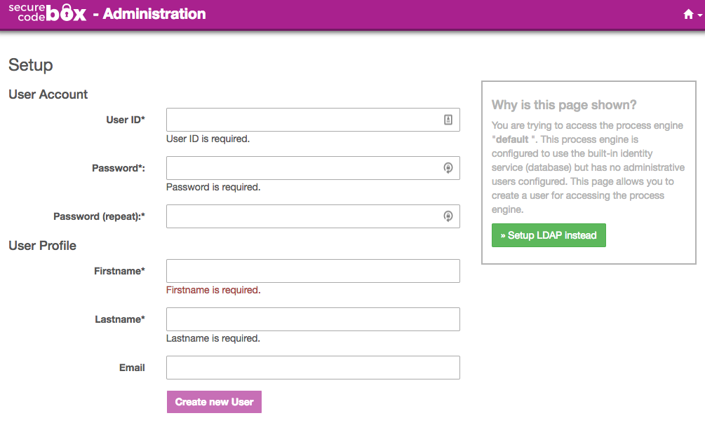
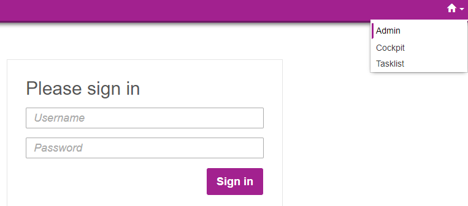
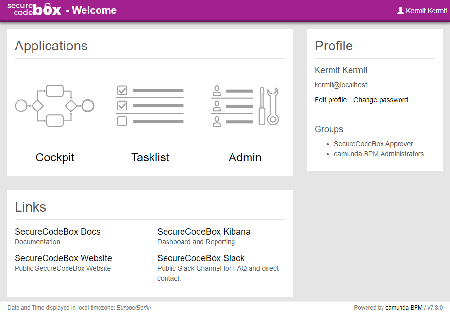
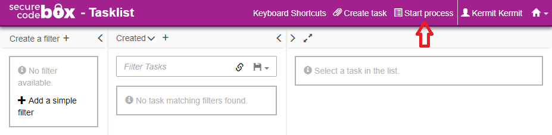
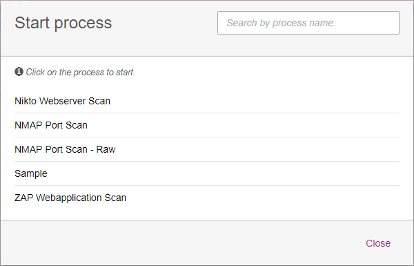
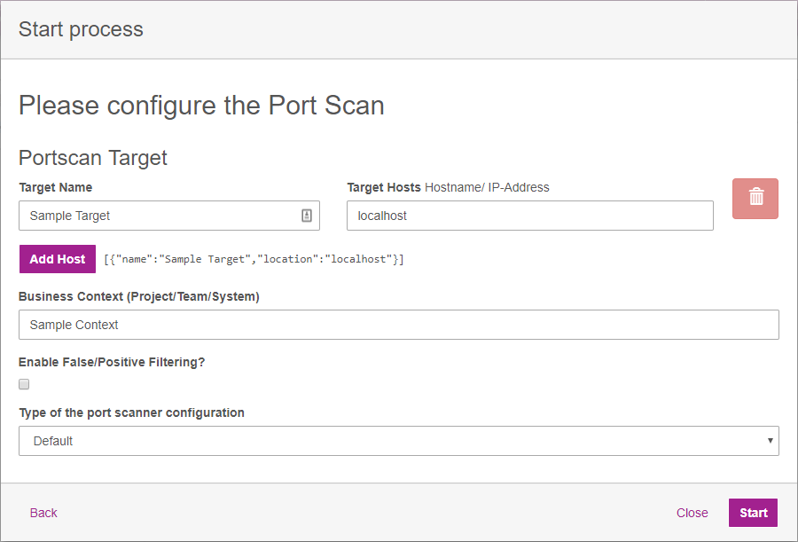

# Using the secureCodeBox

## First startup

1.  Access the engine [http://your-docker-host:8080/](http://localhost:8080)
2.  Choose your admin credentials.



## First time login

1.  Access the engine [http://your-docker-host:8080/](http://localhost:8080)
2.  Access the admin login from the dropdown menu behind the 🏠 in the top right corner



3.  Use the following credentials for your first login:

```
Username: choosen Username
Password: choosen Password
```

4. You are now logged in. Additional users can be created in the user managment section. New users are created without any permissions by default. They are not even permitted to log in. This can be changed by assigning them to the pre-exsisting groups or by granting them the required permission individually.


## Starting Scan-Processes using the Camunda UI

1.  After logging in via [http://your-docker-host:8080/](http://localhost:8080), the welcome screen will be displayed. From here you can start the different Camunda Web Apps.

- `Cockpit` is used for monitoring running and ended process instances.
- `Admin` is used for managing users, groups and authorizations.
- `Tasklist` is used for user tasks and starting processes.



2.  Click on `Tasklist` to see the list of open tasks.



3.  Next select `Start process` to open the list of available processes.



4.  Choose the desired scan process to display the form for configuring the scan. In this example `Nmap Port Scan` has been used.



5.  Finally, start the scan process by clicking `Start`.

> **Note**: A more detailed guide for the Camunda UI can be found [here][camundawebapps].

[camundawebapps]: https://docs.camunda.org/manual/7.8/webapps/

## Configuring Persistence Providers

The secureCodeBox can save the security tests results into different data stores. A list with all availible stores and how to configure and use them can be found [here](./persistence/README.md).

## Starting securityTests using the REST-API

In order to start a scan via the REST-API, send a PUT-Request to the following URL:
`<<Engine_Address>>/box/securityTests`.

The scanning target is set within the payload. A securityTest running a nmap port scan woud look like this:

```json
[
  {
    "name": "nmap",
    "context": "Feature Team 1",
    "target": {
      "name": "example.com website",
      "location": "example.com",
      "attributes": {
        "NMAP_PARAMETER": "-Pn"
      }
    }
  }
]
```

You can check out a more detailed API documentation in the Swagger Docs of the secureCodeBox Engine. The Swagger Docs come together with the secureCodeBox Engine. You can access it at `<<Engine_Address>>/swagger-ui.html`. If you dont have one running yet you can look at the staticly exported version of it here: [Static API Docs](../developer-guide/api-doc.md)

### In Depth Scan Examples

The following links contain completes examples and explanations how to set up and start scans against demo application.

1.  [Scanning modern Single Page Applications like OWASP Juice Shop using Arachni](./usage-examples/arachni-juice-shop-example.md)
2.  [Scanning Server Rendered Applications like BodgeIt Store using Arachni](./usage-examples/arachni-bodgeit-example.md)
3.  [Scanning Server Rendered Applications like BodgeIt Store using OWASP ZAP](./usage-examples/zap-bodgeit-example.md)

## Meta Fields and How to use them

MetaFields can be used to tag security tests with custom data relevant for you. We have encountered some data values which we found paticulary usefull and standardized their format to be used in multiple places. The list and formats can be found [here](./metafields/README.md).

## Starting Scan-Processes using the CLI

We have introduced a [simple secureCodeBox CLI](../../cli/README.md) which is based on the REST-API. This CLI can be used to configure and start Scan-Process or to integrate with you CI/CD Pipeline (e.g. Jenkins).
