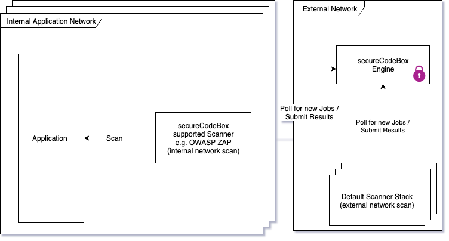

# Multi Tenancy / Multi Environment Support

The basic principle of multi-tenancy support in the secureCodeBox is to get the _scanners running inside protected networks_.
This way the scanners are able to access the service directly without the interference of any firewall. The network connectivity between the scanner and the engine works, as-long as the scanner is able to send out http requests to the engine.

> The engine never actively sends out requests to the scanner, the communication is always initiated asynchronously and by pulling from the scanner side. The Engine only responds to incoming http requests from the scanner.

So in a multi-tenant / multi-environment secureCodeBox setup there would be two different types of scanner working on jobs.

1. Specialised scanner, located in isolated networks, handling scans especially for these networks.
2. Default scanner handling Jobs without specific network access.



To separate which scanner should be able to work on which scan the secureCodeBox relies on the camunda user management. Every scanner has to authenticate itself against the engine to communicate with it. The authentication and authorization system of camunda is structured into three main concepts:

1. `Users`: The basic building block
2. `Authorization`: An authorization represents a specific right. The are structure of a type of object, e.g. a "user", and a list of action allowed to be performed on the object, e.g. "create", "update".
3. `Groups`: A group is a collection of users assigning them a specific role. The secureCodeBox creates three different roles by default.
   1. `camunda-admin` for administration users, with the ability to do everything.
   2. `scanner` for the technical users of the scanners, with the ability to fetch scan jobs and submit results
   3. `continuousIntegration` to start security tests from ci systems like "jenkins" or "travis".
4. `Tenants`: A tenant groups together users from a business centric view. E.g. all users of a team would be part a of a tenant.

## Example

As an example, let imagine the following example:

A company consisting of many different deployment teams has a shared secureCodeBox instance. "Team Blue" now wants to test their internal payment microservice which is running in a protected network. To get started the team sets up a camunda Tenant called:

- "Team Blue" (id: "team_blue")

And two users:

- TeamBlueJenkins: (id: `team_blue_dispatcher`) (group: `continuousIntegration`) (tenant: `team_blue`)

- TeamBlueZap: (id: `team_blue_internal_zap`) (group: `scanner`) (tenant: `team_blue`)

The Scanner needs to be deployed in the network. The setup will depend on their network, e.g. when the network is a protected vpc in aws the scanner could be deployed via fargate in the same vpc.

More generally they want to get the scanner container running and provide it with three pieces of information:

1. Address of the engine
2. Username of the technical user
3. Password of the technical user

The most basic setup would be to just start a single container in the network, which could look like this:

```bash
docker run -e ENGINE_BASIC_AUTH_USER="team_blue_internal_zap" -e ENGINE_BASIC_AUTH_PASSWORD="password" -e ENGINE_ADDRESS="https://engine.scb.my-organisation.com" securecodebox/zap:latest
```

Then the ci user can create security tests which can only be worked on by users of the tenant:

```bash
PUT https://engine.scb.my-organisation.com/box/securityTests
[
  {
    "name": "zap",
    "context": "Payment Service Scan",
    "tenant": "team_blue",
    "target": {
      "name": "Payment Service",
      "location": "https://payment.service.testing.my-organisation.com",
      "attributes": {
        "ZAP_BASE_URL": "https://payment.service.testing.my-organisation.com"
      }
    }
  }
]
```

The most important piece of this definition is the _tenant_ attribute of the securityTest. This definition indicates the engine which tenant to start the securityTest with. If the tenant doesn't get specified the process will get started without a tenant and will be worked on by one of the default scanner.

> Note: To start a securityTest as a tenant the starting user has to be a member of the tenant.
